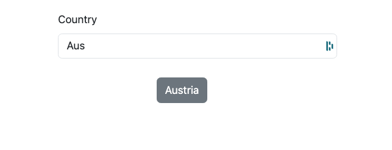
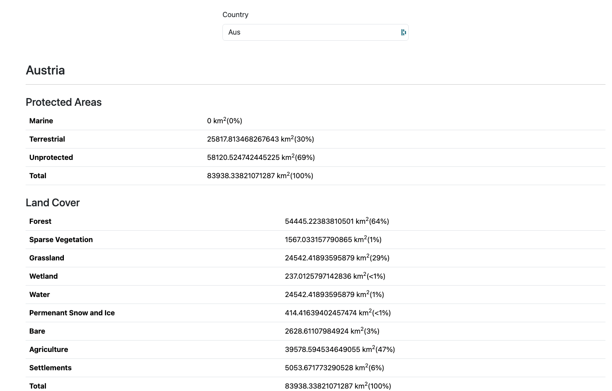

# wcmc-tech-test

## Setup Guide

- Copy the country-metrics.json file into the root directory of the project
- Install Docker Desktop
- `git clone git@github.com:chamithlkml/wcmc-tech-test.git`
- `cd wcmc-tech-test`
- `cp .example-env .env`
- `cd express-app && cp .example-env .env`
- `cd ../express-app/src && cp config-example.json config.json` and set the auth_token
- `docker compose build`
- `docker compose up -d`

### Start express-app

- `docker exec -it app sh` to login to the docker container
- `cd express-app`
- `npm run load` to load json data from country-metrics.json to Database in `features/activity-3.1`
- `npm run dev`

### Start react-app

- `docker exec -it app sh` to login to the docker container
- `cd react-app`
- `npm run start`

### Postman collection related to the API endpoints is available at wcmc-tech-test.postman_collection.json

## Routes to edit dataset

- `PUT /api/metrics/{id}`
- `DELETE /api/metrics/{id}`
- `PUT /api/metrics/data/{id}`
- `DELETE /api/metrics/data/{id}`

### Screenshots

### Notes

- I have created seperate branches for each completed activity.
  - features/activity-1.1
  - features/activity-1.2
  - features/activity-1.3
  - features/activity-1.4
  - features/activity-2.1
  - features/activity-2.2
  - features/activity-2.3
  - features/activity-3.1
  - features/activity-3.2
  